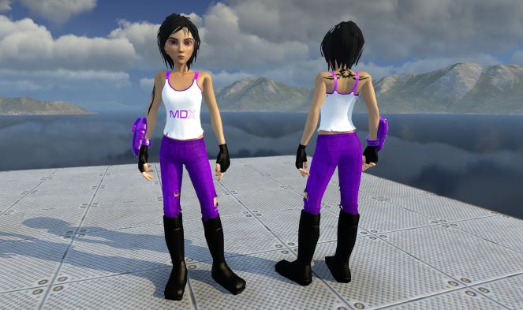

# Shootmania
Shootmania Stuff

https://www.maniaplanet.com/

http://www.maniapark.com/

You can download some Skins from Maniapark. Skins are the 3D Model for a Player and all the Surface Stuff.

These Files are simple ZIP Files or GBX Files (Nadeo Game Box). Dont ask me how to create GBX Files, i dont know. They can have many other Files like DDS or more GBX. So GBX is like ZIP, but it's a special Nadeo Format.

Save the Skins into your Documents Folder. After that you can select the Model in your Profile Settings (Shootmania).

```
C:\Users\<Your Name>\Documents\ManiaPlanet\Skins\Models\ArenaPlayer\
```

MDX.Skin.Pack.Gbx by "Naruto Uzumaki" <3 ;-) many thanks

Locator Files (*.loc) are to make Skins public available. They are Text Files with the URL to download the Model.

Sounds pretty simple, but stop. There are three situations where you can have Models to provide.

* LAN Session (P2P)
* Dedicated Server (Your server)
* Shootmania Online (That's what we want)

P2P has to be enabled and configured in the Maniaplanet Launcher, and you has to configure your Firewall too.

The dedicated Server use another Format (`server/file.zip?dl=1` instead of `http://server/file.zip`) and the Files are in another Location.

In the case of Shootmania Online Locator Files will work, if Locator and Upload-Links (direct downloads) are enabled (both Options are in the Launcher under Help), and if you allow custom Skins (this Option is in your Game Settings if you are connected, otherwise you dont see the custom Skins from other Players). If you have the Steam Version you can open the Launcher, if you start the Game with Steam, not the Icon on the Desktop.

Some Links about the Topic Player Skins and Locator Files

* https://doc.maniaplanet.com/customization/create-a-player-skin
* https://doc.maniaplanet.com/customization/using-custom-content
* https://forum.maniaplanet.com/viewtopic.php?t=44084



